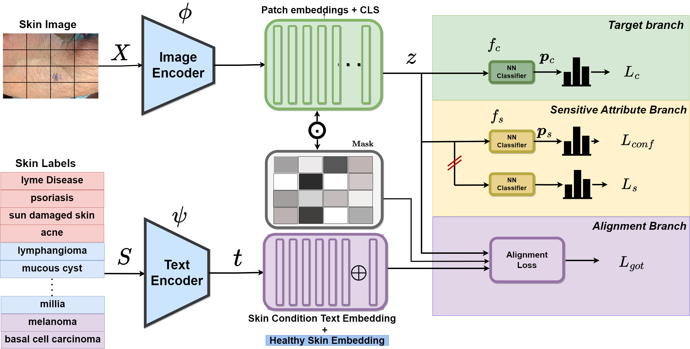

PatchAlign: Fair and Accurate Skin Disease Image Classification by Alignment with Clinical Labels
====================================================


<p align="center">PatchAlign: Our proposed alignment-based skin disease classifier</p>


  * [Requirements](#Requirements)
  * [Data](#Data)
  * [Training](#training)
  * [Evaluation](#evaluation)
  * [Acknowledgements](#acknowledgements)

  Requirements
----------------------
The libraries used and their version requirements for running the code are given in ```requirements.txt```. Please create a virtual environment (conda/pyvenv) to avoid any version conflicts.
```sh
pip install -r requirements.txt
```


Data
----------------------
1. Download Fitzpatrick17k dataset by filling the form [here][1]

2. Download Diverse Dermatology Images (DDI) from [here][2]

3. Use data_play_fitz.ipynb and data_play_ddi.ipynb to remove unknown skin types, encode disease labels, and generate the weights of reweighting and resampling methods.

4. Change the fitzpatrick skin-tones number in ddi_metadata_code.csv from 1,2,3 to 1,3,5 respectively before running the code.
5. Note: For Text Embeddings use 'text_embeddings_3_large_consecutive_averaged.npy' directly or use create_embeddings.ipynb to test other ways of creating text embeddings.


Training
---------------------
Run the following comands to reproduce the results.
Before running the training code,  run create_class_indices.ipynb.
```sh
# 0 - In Domain, 1 - Out Domain A12, 2 - Out Domain A34, 3 - Out Domain A56
# PatchAlign DDI In-Domain Result
python3 -u train_PatchAlign_DDI_InDomain.py 20 full ddi DDI_INDOMAIN

# PatchAlign FitzPatrick17k In-Domain
python3 -u train_PatchAlign_FitzPatrick_InDomain.py 20 full fitzpatrick PATCHALIGN_FITZ_INDOMAIN         

# PatchAlign FitzPatrick17k Out-Domain Result (2 here means A56)
python3 -u train_PatchAlign_FitzPatrick_OutDomain.py 20 full fitzpatrick PATCHALIGN_FITZ_OUTDOMAIN 2

# For Other Results like Fair DisCo, eg: (here 0 means in Domain)
python -u train_DisCo.py 20 full fitzpatrick FairDisCo 0;
python -u train_BASE.py 20 full fitzpatrick Base 0;
# etc.
```

For running the multitask files, first pass the metadata file through create_class_indices_multitask.ipynb ('ddi_metadata_code.csv'  for ddi dataset and 'fitzpatrick17k_known_code.csv' for fitzpatrick dataset).

For DDI Dataset:
Command: `python3 train_DisCo_multitask_ddi.py 25 full ddi multitask_ddi 32 1234`

For Fitzpatrick Dataset:
Command: `python3 train_DisCo_multitask_fitz.py 25 full fitzaptrick multitask_fitz 32 1234`

Evaluation
---------------------
Use multi_evaluate.ipynb


Acknowledgements
----------------

* This code was built on top of the codebase of [FairDisCo][6], [ GOT][10]. We thank the developers of the [Fitzpatrick17k][8] dataset and [DDI][9] dataset for providing the dataset.[ FairDisCo][6] for  providing the baseline.


[1]: https://github.com/mattgroh/fitzpatrick17k
[2]: https://ddi-dataset.github.io/index.html#dataset
[6]: https://github.com/siyi-wind/FairDisCo
[7]: https://arxiv.org/abs/2208.10013
[8]: https://github.com/mattgroh/fitzpatrick17k
[9]: https://ddi-dataset.github.io/
[10]: https://github.com/LiqunChen0606/Graph-Optimal-Transport
